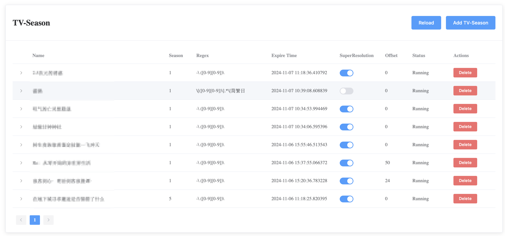

# MikanTracker



一个用于自动追番同时为其他种子提供自动刮削的系统，包括季度下载和电影。

本系统允许你的qBittorrent（下载器）、存储（NAS）、本系统，位于不同的操作系统中。

## Installation

### Environment

因为设计这个项目的初衷是为了在Linux环境中运行。

### Setup

1. 从Github克隆项目仓库
```
git clone https://github.com/your-username/bangumi-manager.git
cd bangumi-manager
```
2. 配置设置，将`config.template.py`复制到`config.py`然后进行设置
3. 配置qBittorrent
    1. `scripts_for_qb/downloaded_new.py`设置为`qBittorrent`下载完成后运行，格式为`.py "%I"`
    2. 设置`scripts_for_qb/downloaded_new.py`中的几个选项
4. 使用pip安装依赖包：`pip install -r requirements.txt`
5. \[Optional\] 安装超分辨率工具需要的环境，详见RealCUGAN-Tensor仓库
6. 方法1: 手动启动
    1. 从`python3 main.py`手动启动本系统
7. 方法2: 将`bangumi_tracker.service`复制到`/etc/systemd/system/`，通过Linux的Service进行管理
    1. `sudo mv bangumi_tracker.service /etc/systemd/system/`
    2. `sudo systemctl daemon-reload`
    3. `sudo systemctl enable --now bangumi_tracker`

## Usage

### TV-Season 管理

####  查看 TV-Season 列表

主界面会显示当前的 TV-Season 列表。
每个 TV-Season 会显示名称、季数、正则表达式规则、过期时间等信息，过期后将不再继续更新内容。

#### 添加新的 TV-Season

点击 "Add TV-Season" 按钮。
在弹出的对话框中填写以下信息:
* 名称 (Name)：用于刮削的名称
* 季数 (Season)：用于刮削的季度
* RSS URL：RSS地址
* 正则表达式规则 (Regex Rule)：用于匹配种子文件中第几集
* 集数偏移 (Episode Offset)：用于刮削，实际存储文件名为正则表达式匹配后的结果+偏移量，这个功能是为了防止字幕组的编号和TMDB等网站的集数不一致导致刮削失败（比如：TMDB 第二季第一集。字幕组 第一集第十三集）。
* 是否需要超分辨率处理 (Need Super Resolution)：在下载完成后是否需要运行超分辨率
如果系统检测到重复的名称和季数,需要再次确认。
点击 "Confirm" 确认添加。

#### 删除 TV-Season

在 TV-Season 列表中,点击相应条目的 "Delete" 按钮。系统会要求确认删除操作。

#### 查看详细信息

点击每个 TV-Season 条目可以展开查看详细的集数信息。
详细信息包括每集的下载状态、超分辨率处理状态等。

#### 重新开始超分辨率处理

在展开的详细信息中,可以对特定集数点击 "ReSR" 按钮重新开始超分辨率处理。